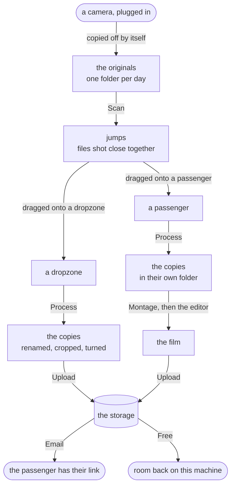
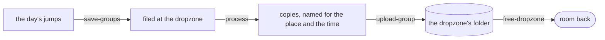
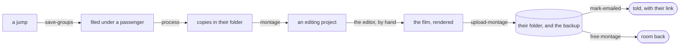
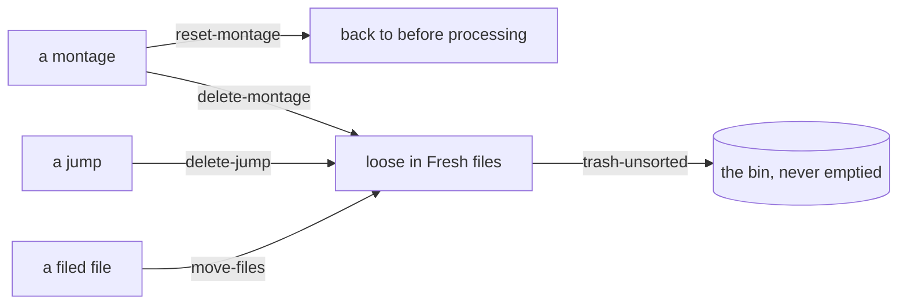

# Where a file goes, and what moves it

> **Generated — do not edit.** Made by `npx tsx scripts/map-the-board.ts`, which reads the board's own code: the list of
> names a request is checked against, the table tying each name to the file answering it, and those
> files' own comments and refusals.
>
> [RULES.md](../RULES.md) says what the app does. This says how it is asked, and by what.

## From plugging a camera in

Each arrow is a thing somebody does. Nothing else moves a file.

A file is only ever in one of those places, and only ever moves for one of those reasons — which is
why the board can say where everything is without remembering anything.

## The journeys, one at a time

### A day at a dropzone

Nobody in particular owns these jumps, so the files go into the dropzone’s folder as they are — no folder per jump, videos and photos together.

### A montage

One name is one folder, and the edit is the one thing that cannot be made again — which is why a montage with a project stops accepting changes.

### Taking something back

Everything goes back one step at a time, and only a loose file in Fresh files — with nowhere further back to go — is ever offered the bin.

## Every way in, in detail

The arrows above are the ones worth remembering. These are all of them — **39**,
of which **24** write the board's own record — grouped by the rule each one serves, in its own
words. Worth reading when you are in one of them, not before.

### Cropping and turning

The rule itself is in [RULES.md](../RULES.md), under _Cropping and turning_.

| asked for | what it does | what it reaches |
| --- | --- | --- |
| `play-file` | A clip handed to the machine's own video player, which plays it at its full size with the graphics card decoding — where the browser, full screen, can only play what it has a decoder for (RULES, Cropping and turning). | works outside the record |

<code>play-file</code> refuses

- That file is no longer on the board.
- _whatever went wrong underneath, in its own words_
- _a message naming the file or the jump_

### Freeing space

The rule itself is in [RULES.md](../RULES.md), under _Freeing space_.

| asked for | what it does | what it reaches |
| --- | --- | --- |
| `free-montage` | Delete a montage from this machine, once the storage is proved to hold all of it (RULES, Freeing space). | writes the record, needs the storage, writes the storage’s list, works outside the record |
| `free-dropzone` | Delete what of a dropzone is on the storage from this machine, once the storage is proved to hold it (RULES, Freeing space). | writes the record, needs the storage, works outside the record |
| `copy-back` | Files this machine gave back, asked for again from the card they are still on. | works outside the record |
| `bring-back` | One file fetched back off the storage, for footage this machine no longer holds: freeing deleted the original once the storage was proved to have it, and this is the way back (RULES, Freeing space). | writes the record, needs the storage, works outside the record |

<code>free-montage</code> refuses

- _whatever went wrong underneath, in its own words_
- Connect the storage first — freeing needs it to prove it holds the files.
- Something is being processed — wait for it to finish.

<code>free-dropzone</code> refuses

- _whatever went wrong underneath, in its own words_
- Connect the storage first — freeing needs it to prove it holds the files.
- Something is being processed — wait for it to finish.

<code>copy-back</code> refuses

- Nothing was asked for.
- The registry could not be read after copying.
- _whatever went wrong underneath, in its own words_

<code>bring-back</code> refuses

- Nothing was asked for.
- _whatever went wrong underneath, in its own words_
- Connect the storage first.

### Going back

The rule itself is in [RULES.md](../RULES.md), under _Going back_.

| asked for | what it does | what it reaches |
| --- | --- | --- |
| `go-back` | The board put back as it was at an earlier step (RULES, Going back): its jumps, names and trims. | answers, and changes nothing |

<code>go-back</code> refuses

- Say which earlier board to go back to.
- _whatever went wrong underneath, in its own words_

### Jumps

The rule itself is in [RULES.md](../RULES.md), under _Jumps_.

| asked for | what it does | what it reaches |
| --- | --- | --- |
| `move-files` | Files go from wherever they are into a jump, a new jump or a place — the one move a drag on the board and a drop from the computer both make (RULES, Jumps). | writes the record, works outside the record |
| `copy-files` | Files copied into another jump, staying where they are as well (RULES, Jumps). | writes the record, works outside the record |
| `delete-jump` | A jump is deleted and its files go back to Unsorted, loose (RULES, Jumps). | writes the record, works outside the record |
| `reset-fresh` | Fresh files put back as a scan would first have left them (RULES, Jumps). | writes the record, works outside the record |

<code>move-files</code> refuses

- Select at least one file to move.
- On the NAS — cropping, re-timing and moving are closed. Take it off the NAS to change it.
- _whatever went wrong underneath, in its own words_

<code>copy-files</code> refuses

- Pick files and a jump to copy them into.
- _whatever went wrong underneath, in its own words_

<code>delete-jump</code> refuses

- That jump is no longer on the board.
- This jump is on the storage only — there is nothing here to move.
- This jump is on the storage — uploaded is the end of editing.
- It is being uploaded — delete it once the upload is done.
- Something is being processed — wait for it to finish.

<code>reset-fresh</code> refuses

- There is nothing in Fresh files to reset.
- Something is being processed — wait for it to finish.

### Making a montage

The rule itself is in [RULES.md](../RULES.md), under _Making a montage_.

| asked for | what it does | what it reaches |
| --- | --- | --- |
| `make-montage` | Picked files, or a whole jump, made a montage under one name (RULES, Making a montage). | writes the record, works outside the record |

<code>make-montage</code> refuses

- Pick the files the montage is made of.
- Give the montage a name.
- _whatever went wrong underneath, in its own words_

### Network storage

The rule itself is in [RULES.md](../RULES.md), under _Network storage_.

| asked for | what it does | what it reaches |
| --- | --- | --- |
| `upload-group` | A jump, several, or a whole place goes up to its folder on the storage, each file checked against what is already there before a byte moves (RULES, Network storage). | needs the storage |

<code>upload-group</code> refuses

- Upload needs a group or a destination.
- Upload a montage from its own card: its film and photos go to its folder and its original videos to the backup, which an upload of the whole folder cannot do.
- It is being processed — upload it once that is done.
- _whatever went wrong underneath, in its own words_
- _a message naming the file or the jump_
- Connect the storage first.

### Places

The rule itself is in [RULES.md](../RULES.md), under _Places_.

| asked for | what it does | what it reaches |
| --- | --- | --- |
| `remove-destination` | A place taken off the board: what was filed there is back in Fresh files, keeping its jumps and everything decided about them (RULES, Places). | writes the record, works outside the record |

<code>remove-destination</code> refuses

- Removing a place needs to know which one.
- That place is no longer on the board.
- A montage there has an edit — change it in kdenlive first.
- Something there is on the storage — uploaded is the end of editing.
- Something is being processed — wait for it to finish.

### Principles

The rule itself is in [RULES.md](../RULES.md), under _Principles_.

| asked for | what it does | what it reaches |
| --- | --- | --- |
| `montage-link` | A montage's folder on the storage, handed out by a link — made, or taken away — and the storage's list told which, so that any machine of the club sees it. | writes the record, needs the storage, writes the storage’s list, works outside the record |
| `destination-link` | A destination's folder on the storage handed out by a link — made, or taken away — by hand: uploading into a destination gives it none. | writes the record, needs the storage, works outside the record |

<code>montage-link</code> refuses

- That folder is not one SkyDock delivers into.
- The storage did not say which link that is.
- The storage would not take that link away.
- _whatever went wrong underneath, in its own words_
- This montage is not on the storage’s list — upload it first.
- Connect the storage first — the list of montages is kept there.

<code>destination-link</code> refuses

- That is not a destination of this board.
- That folder is not one SkyDock delivers into.
- The storage did not say which link that is.
- The storage would not take that link away.
- _whatever went wrong underneath, in its own words_
- Connect the storage first.

### Putting files in the bin

The rule itself is in [RULES.md](../RULES.md), under _Putting files in the bin_.

| asked for | what it does | what it reaches |
| --- | --- | --- |
| `trash-unsorted` | Files nobody wants go to the bin, from Fresh files or out of a montage (RULES, Putting files in the bin). | writes the record, works outside the record |
| `from-bin` | Files taken back out of the bin (RULES, Putting files in the bin): moved into the originals under the day each was shot, and scanned, which puts them in Fresh files as a scan puts any new file. | works outside the record |

<code>trash-unsorted</code> refuses

- Select at least one file to put in the bin.
- _whatever went wrong underneath, in its own words_
- Something is being processed — wait for it to finish.

<code>from-bin</code> refuses

- Pick the files to bring back.
- The registry could not be read after bringing them back.
- _whatever went wrong underneath, in its own words_

### Taking a montage back

The rule itself is in [RULES.md](../RULES.md), under _Taking a montage back_.

| asked for | what it does | what it reaches |
| --- | --- | --- |
| `reset-montage` | Back to before processing, keeping every decision — or undone altogether (RULES, Taking a montage back). | writes the record, works outside the record |
| `delete-montage` | Back to before processing, keeping every decision — or undone altogether (RULES, Taking a montage back). | writes the record, works outside the record |

<code>reset-montage</code> refuses

- _whatever went wrong underneath, in its own words_

<code>delete-montage</code> refuses

- _whatever went wrong underneath, in its own words_

### The board

The rule itself is in [RULES.md](../RULES.md), under _The board_.

| asked for | what it does | what it reaches |
| --- | --- | --- |
| `save-groups` | The board's own picture of the jumps, the places and each file's crop, saved as sent — bar what a frozen montage forbids — and answered with what was saved, so the board redraws from the server rather than trusting its own optimistic copy (RULES, The board). | writes the record |
| `look-at-board` | The board looks at its record again, because the record changed under nobody's hand here — another tab, a script, a hand edit (RULES, The board). | answers, and changes nothing |

<code>save-groups</code> refuses

- Save needs groups.
- _whatever went wrong underneath, in its own words_
- On the NAS — cropping, re-timing and moving are closed. Take it off the NAS to change it.

### The editing project

The rule itself is in [RULES.md](../RULES.md), under _The editing project_.

| asked for | what it does | what it reaches |
| --- | --- | --- |
| `montage` | A processed montage gets an editing project, the template as its owner made it with the clips in its bin, and the project is opened in the same press: it exists to be edited (RULES, The editing project). | writes the record, works outside the record |

<code>montage</code> refuses

- Group not found.
- Only a named montage gets a project — give it a name first.
- Process this montage before making its project.
- Processed folder not found. Process it again.
- This montage already has a project — open it in kdenlive.
- _whatever went wrong underneath, in its own words_
- _a message naming the file or the jump_

### The workflow

The rule itself is in [RULES.md](../RULES.md), under _The workflow_.

| asked for | what it does | what it reaches |
| --- | --- | --- |
| `camera-copied` | A camera plugged in has been copied off and scanned on the machine: the board looks again, and hears what came off (RULES, The workflow). | answers, and changes nothing |

### Times and dates

The rule itself is in [RULES.md](../RULES.md), under _Times and dates_.

| asked for | what it does | what it reaches |
| --- | --- | --- |
| `shift-group-time` | A jump's files move in time together, so that its earliest file lands on the anchor (RULES, Times and dates). | writes the record |
| `retime-file` | One file's time corrected on its own (RULES, Times and dates). | writes the record |

<code>shift-group-time</code> refuses

- Shift needs a group id.
- Shift needs a valid anchor time.
- Group not found.
- Group has no files.

<code>retime-file</code> refuses

- Correct one file at a time.
- That is not a time.
- This file is on the storage — uploaded is the end of editing.
- That file is no longer on the board.

### Where the jump is in a clip

The rule itself is in [RULES.md](../RULES.md), under _Where the jump is in a clip_.

| asked for | what it does | what it reaches |
| --- | --- | --- |
| `set-moment` | One of a jump's moments, moved by hand. | writes the record, works outside the record |

<code>set-moment</code> refuses

- Move one mark at a time.
- Say which moment it is.
- That file is no longer on the board.
- A jump goes door, opening, canopy, ground — the marks have to say the same.

### No rule named

| asked for | what it does | what it reaches |
| --- | --- | --- |
| `merge-groups` | Two jumps become one, and the one may be re-timed in the same move so that it starts, by its own run, at the anchor. | writes the record |
| `open-montage` | the project is already there — this is the way back into it | works outside the record |
| `process` | Process the jumps asked for — by id, by place, or all of them — and answer with the manifest as processing left it. | answers, and changes nothing |
| `process-wait` | a page that came back while something was being processed waits here for it to finish | answers, and changes nothing |
| `cancel-process` | Stops what is being processed, and answers once it has stopped, with the board as the run left it: the copies already finished stay on the disk, and nothing of the run counts as processed. | answers, and changes nothing |
| `upload-wait` | a page that came back while something was being uploaded waits here for it to finish, and gets the board as the upload left it | answers, and changes nothing |
| `cancel-upload` | Stops what is being uploaded, at any moment, and answers once it has stopped: nothing of it is recorded, and what was already sent is found again by the next upload. | answers, and changes nothing |
| `upload-montage` |  | works outside the record |
| `reset-moments` | The marks put back where the camera measured them, whatever was moved by hand since. | writes the record, works outside the record |
| `redo-moments` | For development only: a clip forgets where its jump is, marks moved by hand and all, and the pass that finds it runs again at once, with its progress shown as ever — for trying the finding out on real footage. | writes the record, works outside the record |
| `regroup-loose` | the loose files of the sorting area are clustered into jumps again, by time | writes the record |
| `imported` | files were just added — from the computer, one request each, or off a camera as each lands: the board looks again, and hears how a drop went when there is a drop to hear about | answers, and changes nothing |
| `mark-emailed` | The passenger was emailed — or, taken back, was not. | writes the record, needs the storage, writes the storage’s list |

<code>merge-groups</code> refuses

- Merge needs two group ids.

<code>open-montage</code> refuses

- This montage has no project yet — make it first.
- _whatever went wrong underneath, in its own words_

<code>process</code> refuses

- It is being uploaded — process it again once the upload is done.
- _whatever went wrong underneath, in its own words_

<code>cancel-process</code> refuses

- Nothing is being processed.

<code>cancel-upload</code> refuses

- Nothing is being uploaded.

<code>reset-moments</code> refuses

- Put back one clip at a time.
- That file is no longer on the board.
- Its marks are where the camera put them.

<code>redo-moments</code> refuses

- This is only for development.
- Redo one clip at a time.
- That file is no longer on the board.

<code>regroup-loose</code> refuses

- Nothing to regroup — the sorting area has no loose files.

<code>mark-emailed</code> refuses

- Say which montage was emailed.
- This montage is not on the board or on the storage’s list.
- This montage is not on the board.

## What refuses what

One rule enforced in one place is easy to see. These are enforced in several, which is the part that
is hard to hold in your head: the same sentence, said by everything that has to say it.

**Something is being processed — wait for it to finish.**
`delete-jump` · `remove-destination` · `reset-fresh` · `trash-unsorted` · `free-montage` · `free-dropzone`

**That file is no longer on the board.**
`retime-file` · `set-moment` · `reset-moments` · `redo-moments` · `play-file`

**Connect the storage first.**
`upload-group` · `destination-link` · `bring-back`

**On the NAS — cropping, re-timing and moving are closed. Take it off the NAS to change it.**
`save-groups` · `move-files`

**Group not found.**
`montage` · `shift-group-time`

**Connect the storage first — freeing needs it to prove it holds the files.**
`free-montage` · `free-dropzone`

**That folder is not one SkyDock delivers into.**
`montage-link` · `destination-link`

**The storage did not say which link that is.**
`montage-link` · `destination-link`

**The storage would not take that link away.**
`montage-link` · `destination-link`

**Nothing was asked for.**
`copy-back` · `bring-back`

## The other ways in

These are the board's own, not everything that writes. `api/nas` has a list of its own,
`api/share-link` another, and `api/scan`, `api/import` and `api/templates` write with no intent
at all — the Scan button is one of those. They are named here so this does not pretend to be
everything.
