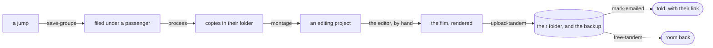
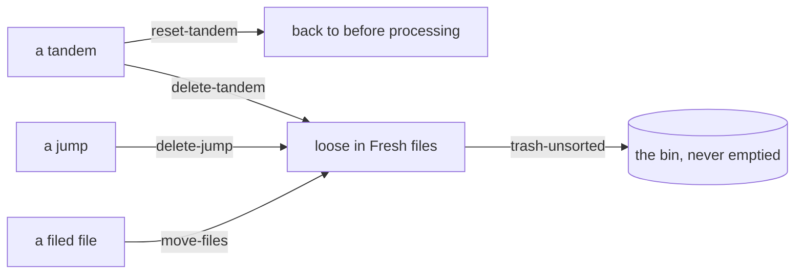

# Where a file goes, and what moves it

> **Generated — do not edit.** Made by `npx tsx scripts/map-the-board.ts`, which reads the board's own code: the list of
> names a request is checked against, the table tying each name to the file answering it, and those
> files' own comments and refusals.
>
> [RULES.md](../RULES.md) says what the app does. This says how it is asked, and by what.

## From plugging a camera in

Each arrow is a thing somebody does. Nothing else moves a file.

A file is only ever in one of those places, and only ever moves for one of those reasons — which is
why the board can say where everything is without remembering anything.

## The journeys, one at a time

### A day at a dropzone

Nobody in particular owns these jumps, so the files go into the dropzone’s folder as they are — no folder per jump, videos and photos together.

### A passenger’s tandem

One passenger is one folder, and the edit is the one thing that cannot be made again — which is why a tandem with a project stops accepting changes.

### Taking something back

Everything goes back one step at a time, and only a loose file in Fresh files — with nowhere further back to go — is ever offered the bin.

## Every way in, in detail

The arrows above are the ones worth remembering. These are all of them — **29**,
of which **20** write the board's own record — grouped by the rule each one serves, in its own
words. Worth reading when you are in one of them, not before.

### Cropping and turning

The rule itself is in [RULES.md](../RULES.md), under _Cropping and turning_.

| asked for | what it does | what it reaches |
| --- | --- | --- |
| `play-file` | A clip handed to the machine's own video player, which plays it at its full size with the graphics card decoding — where the browser, full screen, can only play what it has a decoder for (RULES, Cropping and turning). | works outside the record |

<code>play-file</code> refuses

- That file is no longer on the board.
- _whatever went wrong underneath, in its own words_
- _a message naming the file or the jump_

### Freeing space

The rule itself is in [RULES.md](../RULES.md), under _Freeing space_.

| asked for | what it does | what it reaches |
| --- | --- | --- |
| `free-tandem` | Delete a tandem from this machine, once the storage is proved to hold all of it (RULES, Freeing space). | writes the record, needs the storage, writes the storage’s list, works outside the record |
| `free-dropzone` | Delete what of a dropzone is on the storage from this machine, once the storage is proved to hold it (RULES, Freeing space). | writes the record, needs the storage, works outside the record |
| `copy-back` | Files this machine gave back, asked for again from the card they are still on. | works outside the record |

<code>free-tandem</code> refuses

- Connect the NAS first — freeing needs it to prove it holds the files.
- Something is being processed — wait for it to finish.
- _whatever went wrong underneath, in its own words_

<code>free-dropzone</code> refuses

- Connect the NAS first — freeing needs it to prove it holds the files.
- Something is being processed — wait for it to finish.
- _whatever went wrong underneath, in its own words_

<code>copy-back</code> refuses

- Nothing was asked for.
- The registry could not be read after copying.
- _whatever went wrong underneath, in its own words_

### Jumps

The rule itself is in [RULES.md](../RULES.md), under _Jumps_.

| asked for | what it does | what it reaches |
| --- | --- | --- |
| `move-files` | Files go from wherever they are into a jump, a new jump or a place — the one move a drag on the board and a drop from the computer both make (RULES, Jumps). | writes the record, works outside the record |
| `copy-files` | Files copied into another jump, staying where they are as well (RULES, Jumps). | writes the record, works outside the record |
| `delete-jump` | A jump is deleted and its files go back to Unsorted, loose (RULES, Jumps). | writes the record, works outside the record |
| `reset-fresh` | Fresh files put back as a scan would first have left them (RULES, Jumps). | writes the record, works outside the record |

<code>move-files</code> refuses

- Select at least one file to move.
- On the NAS — cropping, re-timing and moving are closed. Take it off the NAS to change it.
- _whatever went wrong underneath, in its own words_
- This tandem has an edit — change it in kdenlive.

<code>copy-files</code> refuses

- Pick files and a jump to copy them into.
- _whatever went wrong underneath, in its own words_
- This tandem has an edit — change it in kdenlive.

<code>delete-jump</code> refuses

- That jump is no longer on the board.
- This jump is on the storage only — there is nothing here to move.
- This jump is on the storage — uploaded is the end of editing.
- Something is being processed — wait for it to finish.
- This tandem has an edit — change it in kdenlive.

<code>reset-fresh</code> refuses

- Something is being processed — wait for it to finish.
- There is nothing in Fresh files to reset.

### Montage

The rule itself is in [RULES.md](../RULES.md), under _Montage_.

| asked for | what it does | what it reaches |
| --- | --- | --- |
| `montage` | A processed tandem gets an editing project with its clips in the bin and empty tracks to lay them on, and the project is opened in the same press: it exists to be edited (RULES, Montage). | writes the record, works outside the record |

<code>montage</code> refuses

- Group not found.
- Only a tandem gets a montage — give it a passenger first.
- Process this tandem before making its montage.
- Processed folder not found. Process it again.
- This tandem already has a project — open it in kdenlive.
- _whatever went wrong underneath, in its own words_

### Network storage

The rule itself is in [RULES.md](../RULES.md), under _Network storage_.

| asked for | what it does | what it reaches |
| --- | --- | --- |
| `upload-group` | A jump, several, or a whole place goes up to its folder on the storage, each file checked against what is already there before a byte moves (RULES, Network storage). | writes the record, needs the storage, says how far it has got |

<code>upload-group</code> refuses

- Upload needs a group or a destination.
- Upload a tandem from its own card: its film and photos go to the passenger and its original videos to the backup, which an upload of the whole folder cannot do.
- Not connected to NAS. Please connect first.
- _whatever went wrong underneath, in its own words_
- _a message naming the file or the jump_

### Putting files in the bin

The rule itself is in [RULES.md](../RULES.md), under _Putting files in the bin_.

| asked for | what it does | what it reaches |
| --- | --- | --- |
| `trash-unsorted` | Unsorted files nobody wants go to the bin (RULES, Putting files in the bin). | writes the record, works outside the record |

<code>trash-unsorted</code> refuses

- Select at least one file to put in the bin.
- Something is being processed — wait for it to finish.
- _whatever went wrong underneath, in its own words_

### Taking a tandem back

The rule itself is in [RULES.md](../RULES.md), under _Taking a tandem back_.

| asked for | what it does | what it reaches |
| --- | --- | --- |
| `reset-tandem` | Back to before processing, keeping every decision — or undone altogether (RULES, Taking a tandem back). | writes the record, works outside the record |
| `delete-tandem` | Back to before processing, keeping every decision — or undone altogether (RULES, Taking a tandem back). | writes the record, works outside the record |

<code>reset-tandem</code> refuses

- This tandem is being processed — wait for it to finish.
- _whatever went wrong underneath, in its own words_

<code>delete-tandem</code> refuses

- This tandem is being processed — wait for it to finish.
- _whatever went wrong underneath, in its own words_

### The board

The rule itself is in [RULES.md](../RULES.md), under _The board_.

| asked for | what it does | what it reaches |
| --- | --- | --- |
| `save-groups` | The board's own picture of the jumps, the places and each file's crop, saved as sent — bar what a frozen tandem forbids — and answered with what was saved, so the board redraws from the server rather than trusting its own optimistic copy (RULES, The board). | writes the record |

<code>save-groups</code> refuses

- Save needs groups.
- On the NAS — cropping, re-timing and moving are closed. Take it off the NAS to change it.
- This tandem has an edit — change it in kdenlive.

### The storage's list of tandems

The rule itself is in [RULES.md](../RULES.md), under _The storage's list of tandems_.

| asked for | what it does | what it reaches |
| --- | --- | --- |
| `restore-tandems` | Tandems the storage's list names are put back on a board that has forgotten them: their files gathered again under the passenger's name, at the times they had (RULES, The storage's list of tandems). | writes the record, needs the storage, works outside the record |

<code>restore-tandems</code> refuses

- Connect the NAS first — the list of tandems is kept there.
- Choose where tandems go on the storage first.
- _whatever went wrong underneath, in its own words_
- None of those tandems’ files are waiting to be sorted here.

### The workflow

The rule itself is in [RULES.md](../RULES.md), under _The workflow_.

| asked for | what it does | what it reaches |
| --- | --- | --- |
| `camera-copied` | A camera plugged in has been copied off and scanned on the machine: the board looks again, and hears what came off (RULES, The workflow). | answers, and changes nothing |

### Times and dates

The rule itself is in [RULES.md](../RULES.md), under _Times and dates_.

| asked for | what it does | what it reaches |
| --- | --- | --- |
| `shift-group-time` | A jump's files move in time together, so that its earliest file lands on the anchor (RULES, Times and dates). | writes the record |
| `retime-file` | One file's time corrected on its own (RULES, Times and dates). | writes the record |

<code>shift-group-time</code> refuses

- Shift needs a group id.
- Shift needs a valid anchor time.
- Group not found.
- Group has no files.
- This tandem has an edit — change it in kdenlive.

<code>retime-file</code> refuses

- Correct one file at a time.
- That is not a time.
- This file is on the storage — uploaded is the end of editing.
- That file is no longer on the board.
- This tandem has an edit — change it in kdenlive.

### Uploading a tandem

The rule itself is in [RULES.md](../RULES.md), under _Uploading a tandem_.

| asked for | what it does | what it reaches |
| --- | --- | --- |
| `upload-tandem` | A tandem's film and photos go to the passenger's folder and its originals to the backup, and the storage's own list of tandems follows (RULES, Uploading a tandem). | writes the record, needs the storage, writes the storage’s list, says how far it has got, works outside the record |

<code>upload-tandem</code> refuses

- Group not found.
- Not connected to NAS. Please connect first.
- _whatever went wrong underneath, in its own words_
- _a message naming the file or the jump_

### Where the jump is in a clip

The rule itself is in [RULES.md](../RULES.md), under _Where the jump is in a clip_.

| asked for | what it does | what it reaches |
| --- | --- | --- |
| `set-moment` | One of a jump's moments, moved by hand. | writes the record |

<code>set-moment</code> refuses

- Move one mark at a time.
- Say which moment it is.
- That file is no longer on the board.
- A jump goes door, opening, canopy, ground — the marks have to say the same.

### No rule named

| asked for | what it does | what it reaches |
| --- | --- | --- |
| `merge-groups` | Two jumps become one, and the one may be re-timed to an anchor in the same move. | writes the record |
| `open-montage` | the project is already there — this is the way back into it | works outside the record |
| `process` | Process the jumps asked for — by id, by place, or all of them — and answer with the manifest as processing left it. | answers, and changes nothing |
| `process-wait` | a page that came back while something was being processed waits here for it to finish | answers, and changes nothing |
| `cancel-process` | Stops what is being processed, and answers once it has stopped, with the board as the run left it: the copies already finished stay on the disk, and nothing of the run counts as processed. | answers, and changes nothing |
| `regroup-loose` | the loose files of the sorting area are clustered into jumps again, by time | writes the record |
| `imported` | files were just added from the computer, one request each: the board looks again, and hears how the whole drop went | answers, and changes nothing |
| `mark-emailed` | The passenger was emailed — or, taken back, was not — and the storage's list is where that is said, so that any machine of the club can see it. | needs the storage, writes the storage’s list |
| `bring-back` | one file fetched back off the storage | writes the record, needs the storage, works outside the record |

<code>merge-groups</code> refuses

- Merge needs two group ids.
- This tandem has an edit — change it in kdenlive.

<code>open-montage</code> refuses

- This tandem has no project yet — make its montage first.
- _whatever went wrong underneath, in its own words_

<code>process</code> refuses

- _whatever went wrong underneath, in its own words_

<code>cancel-process</code> refuses

- Nothing is being processed.

<code>regroup-loose</code> refuses

- Nothing to regroup — the sorting area has no loose files.

<code>mark-emailed</code> refuses

- Connect the NAS first — the list of tandems is kept there.
- This tandem is not on the storage’s list — upload it first.

<code>bring-back</code> refuses

- Nothing was asked for.
- _whatever went wrong underneath, in its own words_

## What refuses what

One rule enforced in one place is easy to see. These are enforced in several, which is the part that
is hard to hold in your head: the same sentence, said by everything that has to say it.

**This tandem has an edit — change it in kdenlive.**
`save-groups` · `merge-groups` · `shift-group-time` · `retime-file` · `move-files` · `copy-files` · `delete-jump`

**Something is being processed — wait for it to finish.**
`delete-jump` · `reset-fresh` · `trash-unsorted` · `free-tandem` · `free-dropzone`

**Group not found.**
`montage` · `upload-tandem` · `shift-group-time`

**That file is no longer on the board.**
`retime-file` · `set-moment` · `play-file`

**On the NAS — cropping, re-timing and moving are closed. Take it off the NAS to change it.**
`save-groups` · `move-files`

**Not connected to NAS. Please connect first.**
`upload-group` · `upload-tandem`

**This tandem is being processed — wait for it to finish.**
`reset-tandem` · `delete-tandem`

**Connect the NAS first — freeing needs it to prove it holds the files.**
`free-tandem` · `free-dropzone`

**Connect the NAS first — the list of tandems is kept there.**
`mark-emailed` · `restore-tandems`

**Nothing was asked for.**
`copy-back` · `bring-back`

## The other ways in

These are the board's own, not everything that writes. `api/nas` has a list of its own,
`api/share-link` another, and `api/scan`, `api/import` and `api/templates` write with no intent
at all — the Scan button is one of those. They are named here so this does not pretend to be
everything.
